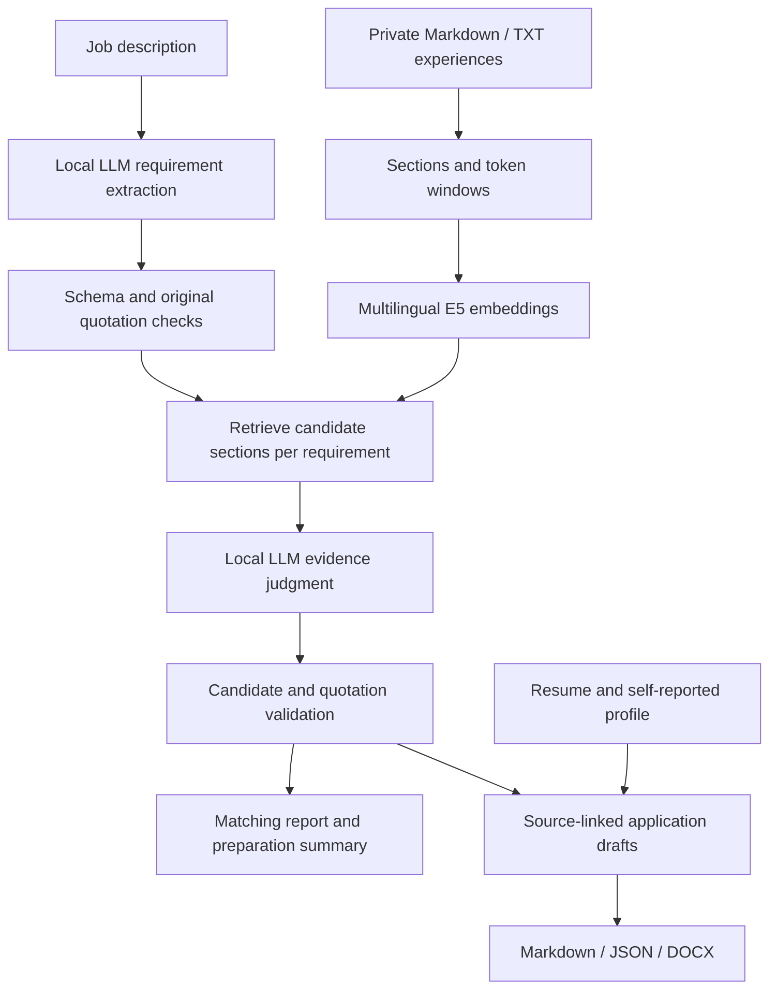

# Job Evidence RAG

**English** | [简体中文](README.zh-CN.md)

**A local job application assistant grounded in your own project experience.**

Turn a job description and a private experience library into an evidence-linked matching report, a preparation plan, CV suggestions, a cover letter, an assembled resume, and interview preparation.

Built as a personal portfolio project with AI-assisted development (Claude Code and Codex as coding assistants; requirements, evidence curation, validation rules and acceptance by the author). The interface and reports are primarily in Chinese; source materials and job descriptions can contain Chinese or English.

> Retrieval similarity is not a hiring probability. Missing evidence does not mean an applicant lacks a skill. Generated application materials are drafts for human review.

## Features

- Multilingual semantic search with `intfloat/multilingual-e5-small`.
- Heading-based ingestion, overlapping token windows, section deduplication, and original source locations.
- Structured JD extraction with required/preferred distinctions, qualifiers, and AND/OR relationships.
- Per-requirement judgments: **direct**, **related**, or **insufficient** evidence; processing failures are separate states.
- Programmatic checks on JSON structure, requirement IDs, candidate IDs, and verbatim quotations.
- Application-readiness summaries with strengths, evidence gaps, prioritized learning exercises, and completion criteria.
- Source-linked CV suggestions, cover letters, resume assembly, interview questions, and STAR preparation.
- DOCX export, a local Flask interface, and a static report viewer.

## Architecture



The retriever uses E5 query/passage prefixes and normalized-vector dot products. Long sections use 320-token windows with 40-token overlap. Results are deduplicated by section and return complete original sections. URLs and standalone evidence lines are retained for provenance but excluded from narrative embedding.

Personal contribution sections are preferred over derived CV/STAR wording when documents follow the project template. The model and corpus embeddings are loaded once per matching run. Vectors are held in memory; there is no persistent vector database or embedding cache.

## Requirements

- Python 3.11 or 3.12 is the recommended starting environment.
- Windows PowerShell is the locally tested workflow; other platforms have not been fully validated.
- Generation requires a separately installed local model service exposing a compatible `/v1/chat/completions` endpoint.
- Initial dependency and embedding-model downloads require network access. Cached embeddings and a local inference service support local processing.

Embedding runs on CPU. Generation memory and speed depend on the model and server you select. This repository does not bundle or train a model.

## Quick start

Download a reviewed source copy and open PowerShell in the directory containing this README:

```powershell
py -3.11 -m venv .venv
.\.venv\Scripts\python.exe -m pip install -r requirements.txt
```

### 1. Try fictional retrieval data

```powershell
.\.venv\Scripts\python.exe search_experience.py --data examples/experiences --check
.\.venv\Scripts\python.exe search_experience.py "SQL database design" --data examples/experiences --top-k 3
```

`examples/experiences/demo_project.md` is fictional and must not be used as real application evidence. `--check` reads files without loading the model. The first actual search downloads E5; use `--offline` after it is cached.

### 2. Configure local generation

```powershell
Copy-Item config.local.example.json config.local.json
```

Edit the copied configuration:

| Field | Meaning |
| --- | --- |
| `model` | Model identifier accepted by your service |
| `base_url` | Local endpoint, for example `http://127.0.0.1:1234/v1` |
| `api_key` | Local service credential if required; never commit real credentials |
| `context_budget` | Model context window in tokens |
| `max_output_tokens` | Reserved output tokens; must be smaller than the context window |
| `chars_per_token` | Heuristic input-budget conversion, not exact tokenization |
| `timeout_seconds` | Per-request timeout |
| `response_format` | `json_object`, `json_schema`, or `none`, according to server support |
| `extra_body` | Optional server-specific request settings |

The example includes a model-specific thinking-mode setting. Remove or adapt it if your server does not support it. There is no automatic cloud fallback: the configured endpoint receives personal source text, so keep it local if local processing is required.

### 3. Match the fictional example

```powershell
.\.venv\Scripts\python.exe match_job.py --jd examples\junior_developer_jd.txt --data examples/experiences --config config.local.json --top-k 3
```

Add `--extract-only` to test JD extraction alone, `--json` for JSON stdout, or `--offline` once the embedding model is cached. Progress goes to stderr.

### 4. Add real experience

```powershell
New-Item -ItemType Directory -Force experiences
Copy-Item project_template.md experiences\my_project.md
```

Replace the template with real actions, results, skills, and evidence. Use personal-contribution headings such as `## 我的贡献 Backend development` or `## My Contributions Backend development`. Distinguish verified records, self-reports, and team-level outcomes.

Basic self-reported facts can go in `experiences/profile.md`; keep your resume in `resume/`. Files or directories starting with `_` or `.` are excluded from normal ingestion. Do not store generated wording as new factual evidence.

Save a real JD as UTF-8 TXT/Markdown, then run:

```powershell
.\.venv\Scripts\python.exe match_job.py --jd jobs\target_role.txt --config config.local.json --offline
```

`add_jd.py` can also save a JD from the clipboard, `--file`, or `--stdin`.

## Browser interface

After adding your own experience, resume, and model configuration:

```powershell
.\.venv\Scripts\python.exe webapp.py --resume resume\base_resume.docx --config config.local.json
```

Open `http://127.0.0.1:5000`. The interface orchestrates CLI stages, processes one job at a time, and displays progress, reports, history, and downloads. A running job can be aborted; aborting a pasted-JD job also removes its unfinished run directory and saved JD file. Interview preparation is off by default and can be generated later for any finished run from the result or history view. It binds to loopback and has no authentication; it is intended for local use, not public hosting.

`start.bat` is a convenience launcher for the original setup and expects a specific resume filename. Use the explicit command above for a different filename.

## Application workflow

Replace `YOUR_RUN_DIRECTORY` with the directory printed by the matching command:

```powershell
$runDir = 'outputs\YOUR_RUN_DIRECTORY'

# Regenerate the preparation summary without rerunning retrieval
.\.venv\Scripts\python.exe job_summary.py --run $runDir --config config.local.json

# Create application drafts and assemble the resume
.\.venv\Scripts\python.exe tailor_cv.py --run $runDir --resume resume\base_resume.docx --config config.local.json
.\.venv\Scripts\python.exe build_resume.py --run $runDir --resume resume\base_resume.docx --config config.local.json

# Export Word documents and prepare interviews
.\.venv\Scripts\python.exe export_docx.py --run $runDir --letter
.\.venv\Scripts\python.exe interview_prep.py --run $runDir --config config.local.json

# Refresh the static viewer
.\.venv\Scripts\python.exe build_site.py
```

Preparation summaries separate evidence gaps from learning needs. The report shows a short priority list; JSON retains all requirement-level advice. If summary generation fails, matching results remain available and the summary can be retried separately.

After requirement extraction, the local model screens location constraints before retrieval. Mandatory on-site or hybrid attendance outside Western Australia with no WA/remote-from-WA option stops the pipeline (CLI exit 3); the web page displays the JD evidence in a popup. Unknown or optional conditions do not automatically block. Screening relies on model interpretation and extracted location requirements; verified quotations establish source presence, not semantic accuracy.

## Outputs

Matching creates `outputs/<timestamp>-<suffix>/`:

| Artifact | Contents |
| --- | --- |
| `jd.txt` | Normalized JD used for source locations |
| `requirements.json` | Requirements, qualifiers, relationships, extraction failures |
| `matches.json` | Judgments and evidence references |
| `job_summary.json` | Preparation advice or summary failure details |
| `report.md` | Matching report and preparation summary |
| `run_meta.json` | Run status, input hashes, model settings, errors |
| `cv_suggestions.*` | Optional CV suggestions and cover-letter drafts |
| `resume_tailored.*` | Optional assembled resume (Markdown and JSON) |
| `<Name>_Resume_<jd>_<MMDD-HHMM>.docx`, `<Name>_Cover_Letter_…docx` | Optional Word exports, named per run so files from different applications cannot be confused |
| `interview_prep.*` | Optional interview preparation |

Extraction-only runs produce the extraction subset. Later generation may add numbered versions. Regenerating a summary updates `report.md` and `job_summary.json`; Word export can replace the DOCX associated with its selected Markdown input.

`match_job.py` returns `0` for a completed matching stage, `1` for failed/partial processing, and `2` for invalid CLI arguments. The optional summary has a separate status.

## Source layout

```text
search_experience.py     Ingestion and reusable E5 retrieval
jd_parser.py            JD extraction and source locations
local_llm.py            Model adapter, schema validation, bounded retries
evidence_matcher.py      Evidence judgment and quotation checks
match_job.py            Matching workflow
job_summary.py          Strengths, gaps, preparation advice
report_writer.py        Matching reports
tailor_cv.py             Application drafting
build_resume.py         Resume assembly
export_docx.py          Word export
interview_prep.py       Interview and STAR preparation
webapp.py / webui/      Local browser interface
build_site.py           Static viewer
examples/               Fictional demonstration inputs
tests/                  Regression and evaluation tooling
```

`import_uwa_kb.py` is an optional importer for the original course-project knowledge-base format; it is not required for general use.

## Testing

```powershell
.\.venv\Scripts\python.exe -m unittest discover -s tests -v
.\.venv\Scripts\python.exe tests/run_eval.py
# After the embedding model has been cached:
.\.venv\Scripts\python.exe tests/run_eval.py --offline
# Optional local generator evaluation:
.\.venv\Scripts\python.exe tests/run_eval.py --config config.local.json
```

All shipped unit tests use synthetic fixtures. The default evaluation uses `examples/experiences/` and `tests/public_eval_set.json`: four fictional requirements, three with section-level recall targets. This is a small smoke check, not a model-accuracy benchmark. A custom `--set` resolves its JD relative to the set file. Mock tests validate software behavior, not hiring success or model accuracy.

## Data handling and public release

Keep personal experiences, resumes, credentials, JDs, generated applications, screenshots, and source-review notes private. Public examples must be fictional or explicitly approved.

Ignore rules exclude private directories from **new** Git additions. They do not remove tracked files or erase old commits. This application was developed inside a larger personal workspace; preparing this README does not make that workspace or its history suitable for publication. Prepare and review a separate source-only release, including its tests and documentation, before publishing.

`make_public_release.py --out <directory>` copies an allowlist into a new or empty directory. Existing files are never overwritten or deleted; `--clean` is unsupported. Every copied text file, including the release script, is scanned for common secret formats. For personal identifiers, supply `--private-patterns <private-file.json>` with a JSON array of regex strings stored outside the release directory. This file is never copied. Automated checks cannot detect all personal data; manually review the output before publishing from a separate Git repository.

Exclude `config.local.json`, `experiences/`, `resume/`, `_sources/`, `_review/`, `jobs/`, `outputs/`, and `site/`. Review older design notes for personal paths and examples. Model requests go to the configured endpoint; initial dependency/model downloads can use the network.

## Limitations

- This is a local prototype, not a production multi-user service.
- A valid quotation can still be misinterpreted; application claims require human review.
- Top-K retrieval can miss evidence or return weak candidates. Similarity is only a ranking signal.
- Context planning uses character-budget heuristics, not exact model token counts.
- Numeric checks establish source presence, not correct experimental interpretation.
- DOCX appearance depends on fonts and office software.
- Source quality and personal/team ownership boundaries affect every generated result.
- The system uses pretrained models; it does not train or fine-tune them.

## Contributing

Include a minimal fictional input, command, platform/Python version, and credential-free model configuration in bug reports. Do not attach private resumes or raw personal outputs.

Explain user-visible changes in pull requests, add meaningful regression tests, and run relevant tests. Keep retrieval, model access, validation, and rendering separate. Use synthetic content for layout previews.

Roadmap: a larger synthetic public evaluation corpus, stronger checks that quotations support claims, persistent embedding caching, and broader platform/model compatibility testing. These are planned improvements, not current guarantees.

## License

MIT License, see [LICENSE](LICENSE). Model and dependency licenses remain separate.
