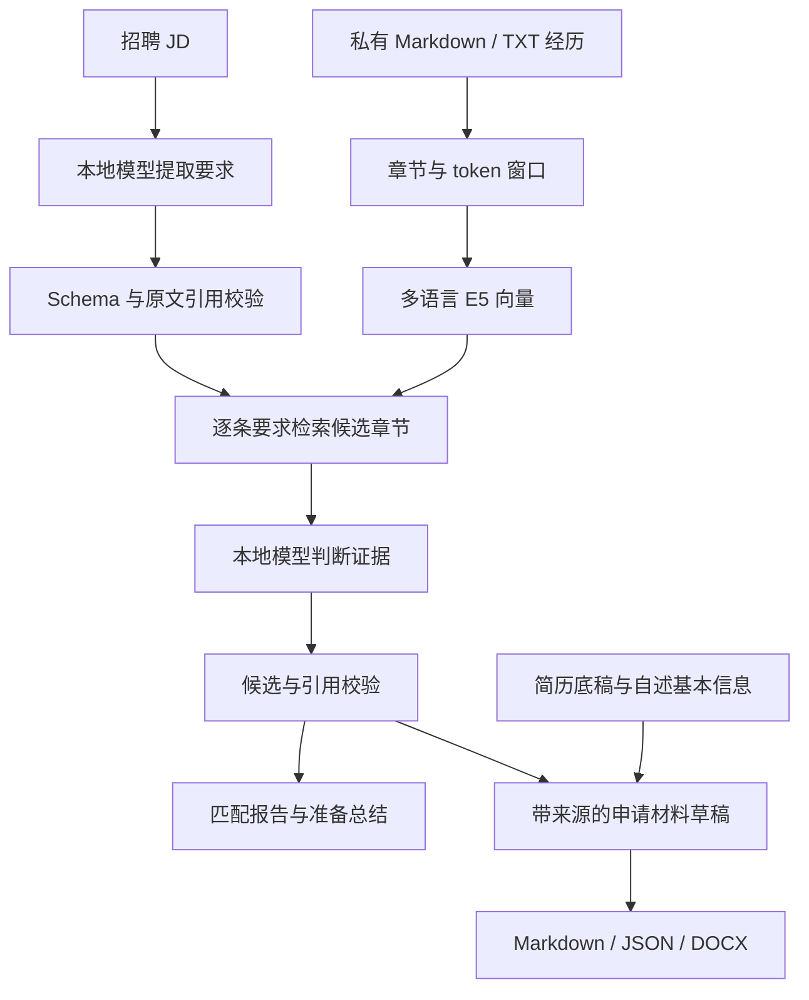

# Job Evidence RAG

[English](README.md) | **简体中文**

**一个立足于你自己项目证据的本地求职助手。**

把一份招聘 JD 和一个私有的经历库，变成一份带证据链接的匹配报告、一份准备计划、CV 建议、Cover Letter、组装好的简历和面试准备。

这是一个个人作品集项目，采用 AI 辅助开发（Claude Code 与 Codex 作为编码助手；需求、证据整理、校验规则和验收由作者负责）。界面与报告以中文为主；经历材料和 JD 可以是中文或英文。

> 检索相似度不是录用概率。缺少证据不代表申请人不具备某项技能。生成的申请材料是供人工审阅的草稿。

## 功能

- 基于 `intfloat/multilingual-e5-small` 的多语言语义检索。
- 按标题切分入库、带重叠的 token 窗口、章节去重，并保留原文位置。
- 结构化的 JD 提取：区分必需与优先、限定条件（年限、环境等）以及 AND/OR 关系。
- 逐条要求的证据判断：**direct**（直接支持）、**related**（相关但不足）、**insufficient**（证据不足）；处理失败是独立状态。
- 程序化校验 JSON 结构、要求 ID、候选 ID 和逐字引用。
- 求职准备总结：优势、证据缺口、按优先级排列的补学练习和完成标准。
- 带来源链接的 CV 建议、Cover Letter、简历组装、面试问题与 STAR 准备。
- DOCX 导出、本地 Flask 网页界面、静态报告查看页面。

## 架构



检索器使用 E5 的 query/passage 前缀和归一化向量点积。长章节按 320 token 分窗、重叠 40 token。结果按章节去重并返回完整原始章节。链接地址和独立的证据行保留用于溯源，但不参与正文向量化。

文档遵循项目模板时，优先使用"个人贡献"章节而不是由此派生的 CV/STAR 措辞。每次匹配运行只加载一次模型并编码一次语料。向量保存在内存中，没有持久化的向量数据库或向量缓存。

## 环境要求

- 推荐 Python 3.11 或 3.12。
- 本地验证过的流程是 Windows PowerShell；其他平台尚未完整验证。
- 生成功能需要单独安装的本地模型服务，提供兼容的 `/v1/chat/completions` 接口。
- 首次安装依赖和下载向量模型需要网络。模型缓存后配合本地推理服务即可完全本地运行。

向量计算在 CPU 上进行。生成阶段的内存和速度取决于你选择的模型和服务。本仓库不附带也不训练模型。

## 快速开始

下载一份审核过的源码副本，在包含本 README 的目录打开 PowerShell：

```powershell
py -3.11 -m venv .venv
.\.venv\Scripts\python.exe -m pip install -r requirements.txt
```

### 1. 用虚构数据试检索

```powershell
.\.venv\Scripts\python.exe search_experience.py --data examples/experiences --check
.\.venv\Scripts\python.exe search_experience.py "SQL database design" --data examples/experiences --top-k 3
```

`examples/experiences/demo_project.md` 是虚构内容，不能当作真实的申请证据。`--check` 只读取文件、不加载模型。第一次真正检索会下载 E5 模型；缓存后可用 `--offline`。

### 2. 配置本地生成模型

```powershell
Copy-Item config.local.example.json config.local.json
```

编辑复制出来的配置：

| 字段 | 含义 |
| --- | --- |
| `model` | 你的服务接受的模型标识 |
| `base_url` | 本地接口地址，例如 `http://127.0.0.1:1234/v1` |
| `api_key` | 本地服务的凭证（如需要）；不要提交真实凭证 |
| `context_budget` | 模型上下文窗口（token） |
| `max_output_tokens` | 为输出预留的 token，必须小于上下文窗口 |
| `chars_per_token` | 输入预算的字符换算系数，是估算而非精确分词 |
| `timeout_seconds` | 单次请求超时 |
| `response_format` | `json_object`、`json_schema` 或 `none`，视服务端支持而定 |
| `extra_body` | 可选的服务端专有请求字段 |

样例里包含一个关闭特定模型"思考模式"的设置。如果你的服务不支持，删除或改写它。没有自动的云端回退：配置的接口会收到个人材料原文，需要本地处理时请保持接口在本机。

### 3. 用虚构示例跑一次匹配

```powershell
.\.venv\Scripts\python.exe match_job.py --jd examples\junior_developer_jd.txt --data examples/experiences --config config.local.json --top-k 3
```

加 `--extract-only` 只测试 JD 提取，`--json` 让标准输出只含 JSON，向量模型缓存后加 `--offline`。进度写到 stderr。

### 4. 加入真实经历

```powershell
New-Item -ItemType Directory -Force experiences
Copy-Item project_template.md experiences\my_project.md
```

用真实的行动、结果、技能和证据替换模板内容。个人贡献章节请使用 `## 我的贡献 后端开发` 或 `## My Contributions Backend development` 这类标题。区分已核对记录、本人自述和团队层面的成果。

学历、地点、工作权利等基本自述事实可以放在 `experiences/profile.md`；简历底稿放在 `resume/`。以 `_` 或 `.` 开头的文件和目录不会被正常入库。不要把生成出来的措辞存回去当作新的事实证据。

把真实 JD 保存为 UTF-8 的 TXT/Markdown，然后运行：

```powershell
.\.venv\Scripts\python.exe match_job.py --jd jobs\target_role.txt --config config.local.json --offline
```

`add_jd.py` 也可以从剪贴板、`--file` 或 `--stdin` 保存 JD。

## 浏览器界面

加入你自己的经历、简历和模型配置之后：

```powershell
.\.venv\Scripts\python.exe webapp.py --resume resume\base_resume.docx --config config.local.json
```

打开 `http://127.0.0.1:5000`。页面按顺序调度各命令行阶段，一次只处理一个任务，显示进度、报告、历史记录和下载。它只绑定本机回环地址，没有登录，只用于本机，不要公开托管。

`start.bat` 是针对原始配置的一键启动器，要求简历底稿使用固定文件名。文件名不同时请使用上面的显式命令。

## 申请材料流程

把 `YOUR_RUN_DIRECTORY` 换成匹配命令打印出的运行目录：

```powershell
$runDir = 'outputs\YOUR_RUN_DIRECTORY'

# 不重跑检索，单独重新生成准备总结
.\.venv\Scripts\python.exe job_summary.py --run $runDir --config config.local.json

# 生成申请材料草稿并组装简历
.\.venv\Scripts\python.exe tailor_cv.py --run $runDir --resume resume\base_resume.docx --config config.local.json
.\.venv\Scripts\python.exe build_resume.py --run $runDir --resume resume\base_resume.docx --config config.local.json

# 导出 Word 文档并准备面试
.\.venv\Scripts\python.exe export_docx.py --run $runDir --letter
.\.venv\Scripts\python.exe interview_prep.py --run $runDir --config config.local.json

# 刷新静态查看页面
.\.venv\Scripts\python.exe build_site.py
```

准备总结会把证据缺口和学习需求分开。报告里只显示简短的优先级清单，JSON 保留全部逐条建议。总结生成失败时匹配结果仍然可用，总结可以单独重试。

## 输出

匹配会创建 `outputs/<时间戳>-<后缀>/`：

| 文件 | 内容 |
| --- | --- |
| `jd.txt` | 规范化后用于原文定位的 JD |
| `requirements.json` | 要求、限定条件、关系、提取失败记录 |
| `matches.json` | 判断与证据引用 |
| `job_summary.json` | 准备建议，或总结失败的详情 |
| `report.md` | 匹配报告与准备总结 |
| `run_meta.json` | 运行状态、输入哈希、模型设置、错误 |
| `cv_suggestions.*` | 可选：CV 建议与 Cover Letter 草稿 |
| `resume_tailored.*` | 可选：组装好的简历与 DOCX 导出 |
| `interview_prep.*` | 可选：面试准备 |

只做提取的运行只产生提取相关的子集。后续生成可能追加带编号的版本。重新生成总结会更新 `report.md` 和 `job_summary.json`；Word 导出会替换与所选 Markdown 对应的 DOCX。

`match_job.py` 的退出码：`0` 表示匹配阶段完成，`1` 表示失败或部分完成，`2` 表示命令行参数无效。可选的总结有独立的状态。

## 源码结构

```text
search_experience.py     入库与可复用的 E5 检索
jd_parser.py            JD 提取与原文定位
local_llm.py            模型适配层、schema 校验、有限次重试
evidence_matcher.py      证据判断与引用校验
match_job.py            匹配流程
job_summary.py          优势、缺口、准备建议
report_writer.py        匹配报告
tailor_cv.py             申请材料起草
build_resume.py         简历组装
export_docx.py          Word 导出
interview_prep.py       面试与 STAR 准备
webapp.py / webui/      本地浏览器界面
build_site.py           静态查看页面
examples/               虚构的演示输入
tests/                  回归测试与评测工具
```

`import_uwa_kb.py` 是针对原作者课程项目知识库格式的可选导入器，一般使用不需要它。

## 测试

```powershell
.\.venv\Scripts\python.exe -m unittest discover -s tests -v
.\.venv\Scripts\python.exe tests/run_eval.py
# 已缓存向量模型后可离线评测：
.\.venv\Scripts\python.exe tests/run_eval.py --offline
# 可选的本地生成模型评测：
.\.venv\Scripts\python.exe tests/run_eval.py --config config.local.json
```

公开版所有单元测试使用合成数据。默认评测使用 `examples/experiences/` 和 `tests/public_eval_set.json`，包含四条虚构要求，其中三条具有章节级召回目标。这是小规模冒烟检查，不代表模型准确率基准。自定义 `--set` 中的 JD 路径相对于评测集文件解析。模拟测试验证程序行为，不代表求职成功率或模型准确率。

## 数据处理与公开发布

个人经历、简历、凭证、JD、生成的申请材料、截图和来源核对记录都应保持私有。公开示例必须是虚构的或经明确许可的。

忽略规则只阻止私有目录被**新**加入 Git，不会移除已跟踪的文件，也不会抹掉旧提交。本应用是在一个更大的个人工作区里开发的，写好这份 README 不代表那个工作区及其历史适合发布。发布前请另行准备并审核一份只含源码的版本，包括它的测试和文档。

`make_public_release.py --out <目录>` 按白名单复制到新建或空目录，不覆盖或删除已有文件，已移除 `--clean`。扫描覆盖发布脚本在内的全部复制文本文件，默认检查常见密钥格式。个人标识规则通过 `--private-patterns <私有文件.json>` 提供，格式是正则表达式字符串数组，须存放在发布目录之外且不会被复制。自动检查无法识别全部个人信息，发布前仍需人工审核，并使用独立 Git 仓库。

需要排除：`config.local.json`、`experiences/`、`resume/`、`_sources/`、`_review/`、`jobs/`、`outputs/`、`site/`。检查旧的设计文档里是否残留个人路径和示例。模型请求会发往配置的接口；首次安装依赖和下载模型可能使用网络。

## 局限

- 这是本地原型，不是可用于生产的多用户服务。
- 引用有效不代表理解正确；申请材料中的说法需要人工审阅。
- Top-K 检索可能漏掉证据或返回弱候选。相似度只是排序信号。
- 上下文规划使用字符预算估算，不是精确的模型 token 计数。
- 数字校验只确认数字存在于来源中，不保证实验解释正确。
- DOCX 的显示效果取决于字体和办公软件。
- 材料质量以及个人/团队归属的边界会影响每一份生成结果。
- 系统使用预训练模型，不做训练或微调。

## 贡献

提交问题时请附上最小的虚构输入、命令、平台与 Python 版本，以及不含凭证的模型配置。不要附带私人简历或原始的个人输出。

Pull Request 请说明用户可见的变化，补充有意义的回归测试，并运行相关测试。保持检索、模型访问、校验和渲染彼此分离。排版预览请使用合成内容。

路线图：扩大合成公开评测语料、更强的"引用是否真的支持说法"检查、持久化向量缓存、更广的平台与模型兼容性测试。这些是计划中的改进，不是当前的保证。

## 许可证

MIT 许可证，见 [LICENSE](LICENSE)。模型和依赖库的许可证另行适用。
